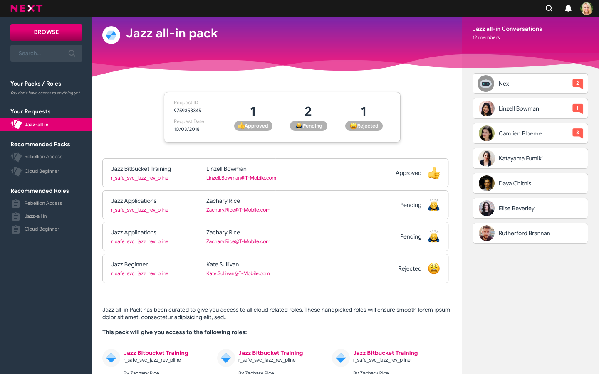
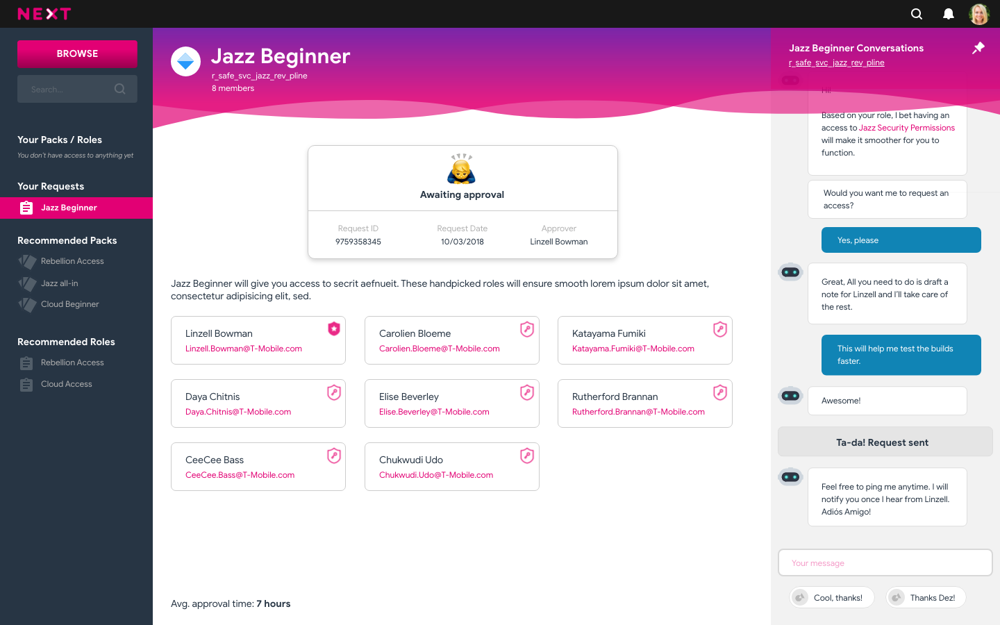
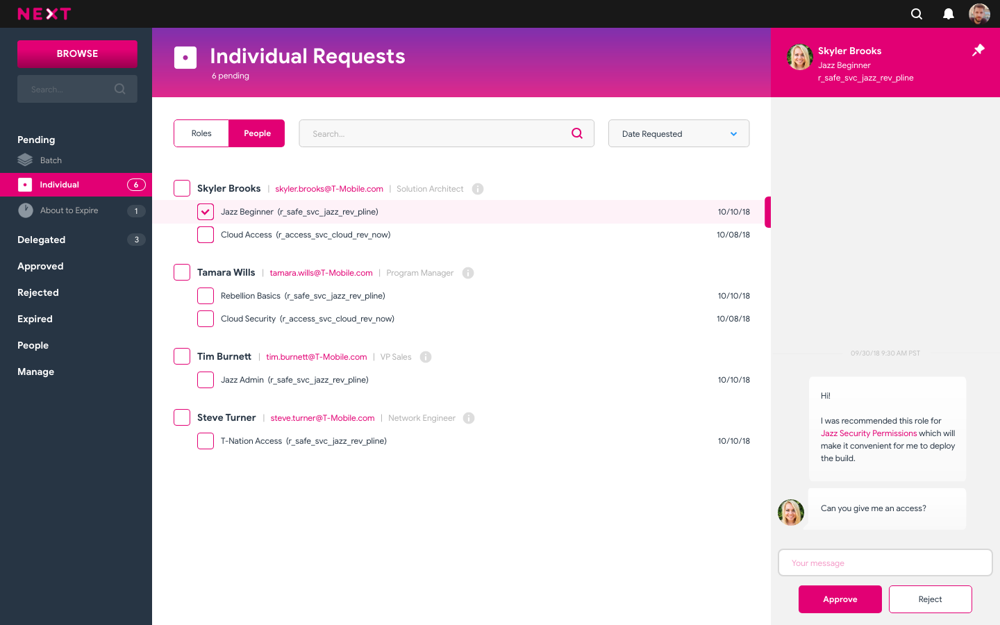
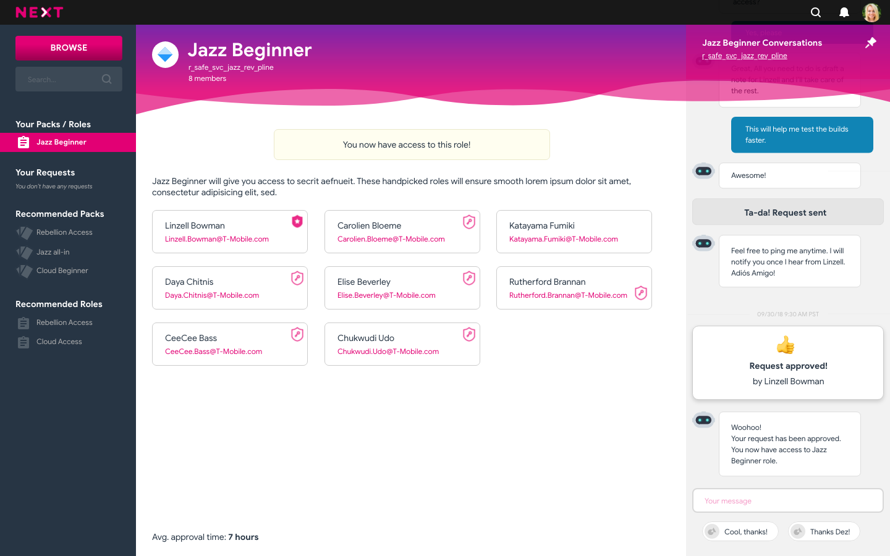
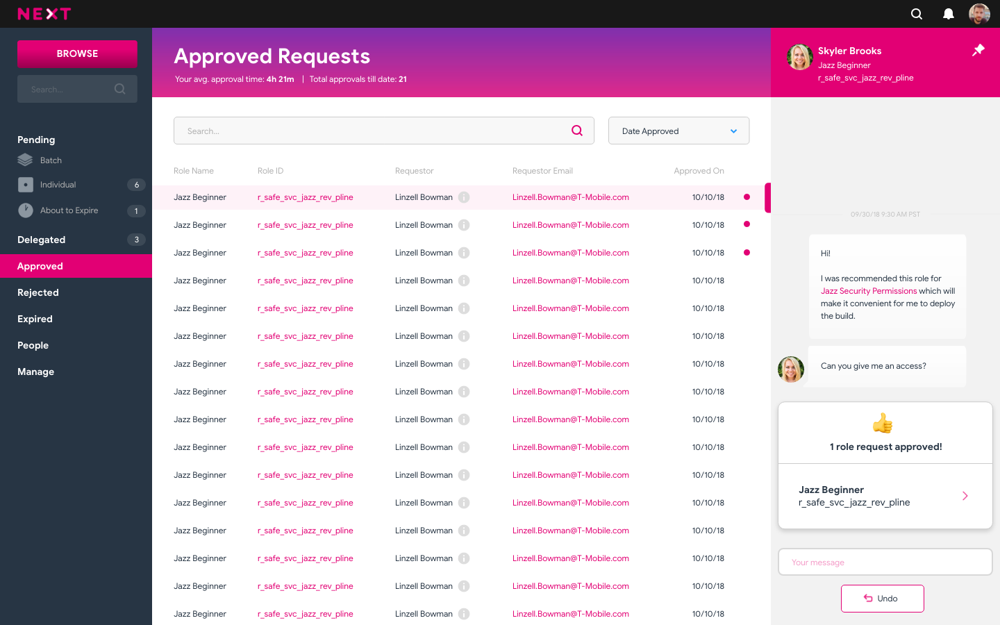

[](https://travis-ci.org/hyperledger/sawtooth-next-directory)
[](https://github.com/hyperledger/sawtooth-next-directory/blob/master/LICENSE)
[](https://sawtooth-next-directory.readthedocs.io/?badge=latest)  


# Hyperledger Sawtooth NEXT Identity Platform
A Federated Tool for Managing Entitlements.

## Introduction
### What is NEXT? 
NEXT is an open-source Identity and Access Management Platform for enterprise. NEXT is built by leveraging the Sawtooth blockchain to not only improve the status-quo of identity governance and auditing, but also replaces trust with cryptographic proof. Originally envisioned and designed by T-Mobile, NEXT is an enterprise-grade blockchain application, built to integrate with a wide-ranging number of indentity consuming and identity-providing applications. NEXT can integrate with industry standard directory services and provide request, approval, and audit features with the integrity of the blockchain.

The main components of NEXT includes: Sawtooth, a modular platform created by Intel that sits atop of The Linux Foundation's Hyperledger project, a transaction processor which handles RBAC-specific transaction logic, and a ledger sync which writes the blockchain state changes to a local database. The NEXT platform also features a chatbot component as well as an intuitive UI which will provide a smooth experience for users. 

At its heart, NEXT is about replacing trust with cryptographic truth. It is a federated tool for managing entitlements. 


### Table of Contents:
* [Application Flow](#application-flow)
* [How to Contribute](#how-to-contribute)
* [Using the Platform](#using-next)
* [Acknowledgements](#Acknowledgements)


## Application Flow  
### _UI for User's Request Dashboard_
  

### _User Requests To Join a Security Group_
  

### _User's Role Request Appears in Admin's Request Dashboard_
  

### _Owner Approves the User's Request and the User is Notified_
 

### _Owner History of Accepted/Reject Permission Requests_
 


This flow highlights the typical use-case of this platform. The a user requests access to be apart of a group. The owner of the group either accepts or rejects the user's request. The owner's activity log gets updated and auditing can be done in a fast and simple manner reducing overhead.


## How to Contribute  
Awesome! So you want to be apart of the NEXT Project. There are a couple of good resources for you to get started with. The first being the [developer setup](https://github.com/hyperledger/sawtooth-next-directory/wiki/Developer-Setup). This document helps to standardize
the developer environment for everyone across different operating systems so when developing, we are all on the same page. 

Here are some ideas on how to get started:

### Good First Issues
Our team has tagged some issues with the "Good First Issues" tag which are issues that can be picked up and worked on without having to know much about the overall guts and intracacies of the system. These [issues](https://github.com/hyperledger/sawtooth-next-directory/labels/good%20first%20issue) will also allow you to gradually get up to speed into the different components of NEXT, which will let you contribute to "bigger" issues down the line.

If you have any questions or comments, or you just want to chat, here is a link to our [Rocketchat](https://chat.hyperledger.org/channel/sawtooth-next-directory)! 


## Using NEXT
The easiest way to set-up the NEXT platform is by using
[Docker](https://www.docker.com/what-docker). To start these components,
first install Docker for your platform and clone this repo.

Docker volume mounts must be enabled, to allow docker to mount the repository
files.

To build and deploy the app, run:

```bash
docker-compose up
```

A shortcut is available via:
```bash
bin/start -b
```

This will build all components, start them in individual Docker containers,
and download and run the necessary Sawtooth components.

- Sawtooth's blockchain REST API will be available at **http://localhost:8080**
- Rethink's database admin panel will be available at **http://localhost:9090**
- The next generation NEXT UI will be available at **http://localhost:4201**


To stop the containers, hit Ctrl-C and then:

```bash
docker-compose down
```

A shortcut is available via:
```bash
bin/stop
```

## Persistent Data

By default, the data in the development environment is ephemeral.
It will be lost when the application is stopped and restarted.

To enable persistent data, use the -p flag:

```bash
bin/start -p
```

To delete the persistent data, delete the related docker volumes:

To clear data and start again from genesis, delete the volumes:
    docker volume ls
    docker volume rm {folder_name}_chain
    docker volume rm {folder_name}_keys
    docker volume rm {folder_name}_db

## Rebuilds

One may tell docker to rebuild the containers, using the the 
`--build` flag. This may be useful if dependencies have changed
in a way docker did not detect. 

```bash
docker-compose up --build
```

A shortcut is available via:
```bash
bin/start -b
```

To do a hard rebuild by first removing all cached docker volumes 
and python caches, run:

```bash
bin/clean
bin/start
```

## Development

#### System Dependencies 

The server code is written in python 3. Confirm your version using command:

    python -V

For information in setting up your development environment, visit:
https://github.com/hyperledger/sawtooth-next-directory/wiki/Developer-Setup

#### Deploying Multi-Node Network

The multi-node network consists of four nodes (more can be added) hosting Sawtooth 
Next Directory. The multi-node network utilizes the PoET simulator consensus 
between the validators allowing PoET to run on non-SGX hardware. 

After starting the containers, the Next Directory UI will be available at:
- **http://10.5.0.70:4200** (node 0)
- **http://10.5.0.71:4200** (node 1)
- **http://10.5.0.72:4200** (node 2)
- **http://10.5.0.73:4200** (node 3)


To start the containers in a multi-node configuration run:
```bash
docker-compose -f docker-multi-node.yaml up
```


## Deploying to Any Non-Localhost Server

Pay special attention to the notes about secret keys in .env. 
Due to their private/sensitive nature, the values of these keys should be 
provided to the application using 
  - a configuration file that is not stored/managed by git 
  - cli arguments 
  - some other means that prevents them from being publicly available
  
They are the most sensitive components for the security of your application.
Manage them wisely and responsibly.

When no such keys are provided, random keys are generated on application
bootstrap to simplify development. This avoids publication of the keys in
git and allows the application to start up in their absence. Work is 
underway to cause startup to fail fast and explosively when keys are missing.
Once that work is complete, the random key generation can be removed as well.
In other words: It must be made obvious to a user when startup fails due to 
missing keys.


## Testing

#### Preparing Unit Tests

If you are unit testing a feature having a new Pip dependency in it, then add the new dependency to tests.Dockerfile
to ensure it is available in the test runtime.

#### Populating Test Data

To quickly populate the application with test users, roles, etc., run script 
bin/populate_test_data.py once the application is up and running. It will spin up
a rest client and create the objects through the application's rest api.

#### Running Automated Tests

Library test can be run using (pytest)[https://docs.pytest.org/en/latest/]:

```bash
pytest -m "library"
```

Integration tests can be run non-interactively via the `run_docker_test` script, 
with the desired docker-compose file as an argument. For example:

```bash
bin/run_docker_test docker-tests.yaml
```

A shortcut is available via:
```bash
bin/build -t
```

They can be run interactively from the rbac-shell:
```bash
docker exec -it rbac-shell bash
pytest
```

Unit tests can be run with the following command:

```bash 
pytest tests/unit/
```

#### Docs Set-up
Documentation for the NEXT project is available (here)[https://sawtooth-next-directory.readthedocs.io/en/latest/]

Here are the following steps to create documentation:
1. Navigate to the home directory and navigate into the "docs" folder. 
2. Create a new reStructuredText file.
3. When editing the reStructuredText file, please follow the guidelines listed (here)[http://docutils.sourceforge.net/rst.html]
4. When finished, save the document and navigate into the "index.rst" file, add your file name without the ".rst" extension into the section you see fit, and then save the document.
5. Once the pull request is approved, your new document should be published and available to read.

#### Cleaning the Docker Image Cache

Docker-compose relies on image caching to improve build and deployment time. Some changes (directory renaming, etc)
can cause the loading of cached images to result in build failures in docker-compose. In addition, not shutting down
containers properly by doing a docker-compose down also leads to this scenario. When it occurs, you will experience
hanging in the legacy UI and stack traces from rbac_server:

     Traceback (most recent call last):
    rbac-server    |   File "/usr/local/lib/python3.5/dist-packages/sanic/app.py", line 556, in handle_request
    rbac-server    |     response = await response
    rbac-server    |   File "/usr/lib/python3.5/asyncio/coroutines.py", line 105, in __next__
    rbac-server    |     return self.gen.send(None)
    rbac-server    |   File "/project/hyperledger-rbac/server/api/users.py", line 74, in create_new_user
    rbac-server    |     request.app.config.AES_KEY, txn_key.public_key, private_key.as_bytes()
    rbac-server    |   File "/project/hyperledger-rbac/server/api/utils.py", line 172, in encrypt_private_key
    rbac-server    |     cipher = AES.new(bytes.fromhex(aes_key), AES.MODE_CBC, init_vector)
    rbac-server    | ValueError: non-hexadecimal number found in fromhex() arg at position 30

To work around this situation, shut down the application, delete all containers and images, and rebuild/deploy:

    bin/stop

    docker rm -vf $(docker ps -a -q)

    docker rmi -f $(docker images -a -q)

    bin/start -b 
    

# License
Hyperledger Sawtooth NEXT Identity Platform software is licensed under the 
[Apache License Version 2.0](LICENSE) software license.

# Acknowledgements
### Big Thanks

Cross-browser Testing Platform and Open Source <3 provided by [Saucelabs]

Continuous Integration Platform provided by [Travis-CI]

Project Management Platform provided by [Zenhub] 

[Saucelabs]: https://saucelabs.com
[Travis-CI]: https://travis-ci.com/
[Zenhub]: https://www.zenhub.com/