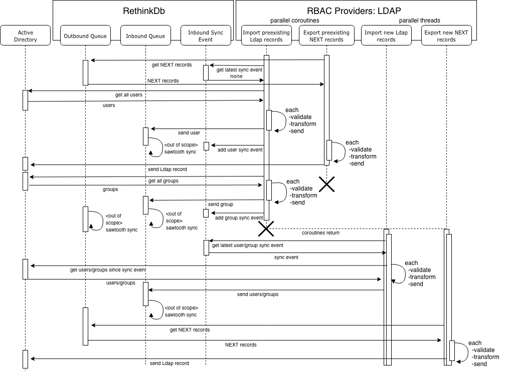

=========
Providers
=========

NEXT Directory Platform has the ability to incorporate various identity providers. 

Here are the providers that we currently support:

* `Active Directory Provider`
* `Azure Active Directory Provider`

Provider modules are housed within the providers package. NEXT is currently using tables in RethinkDb to act as buffers
for Pub/Sub messaging between itself and external systems. Because of this, there are offsets to be reconciled when a
sync job is kicked off. At a high level, there are initial inbound and outbound syncs that transfer the majority of
records between systems followed by scheduled jobs that sync new changes that come in. Refer to the following diagram:

    Ldap inbound and outbound sync
